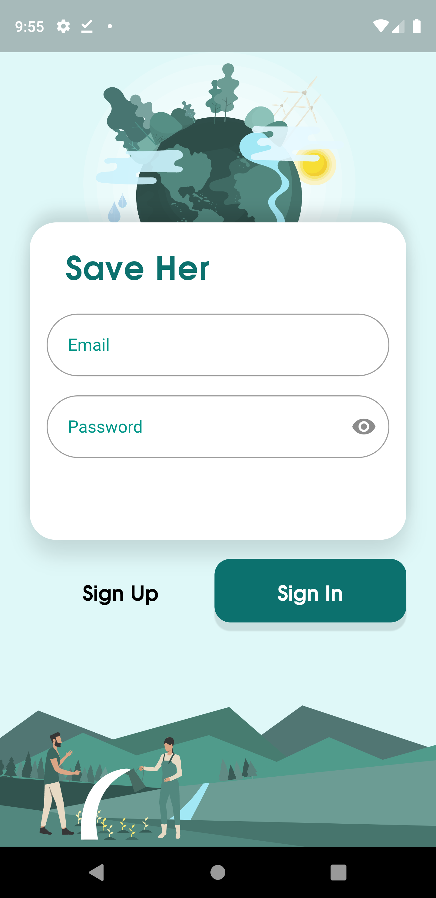
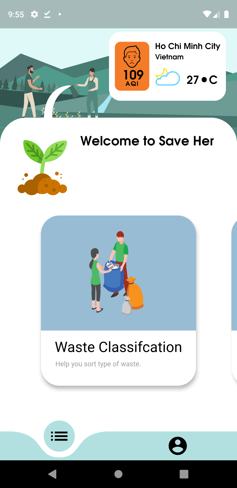
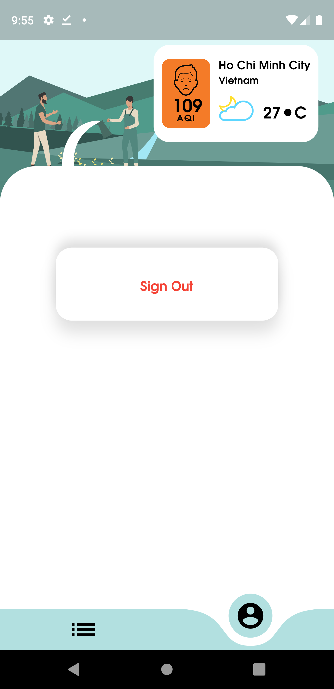
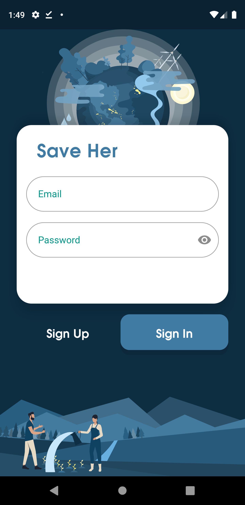

**Save Her**

Earth is dying everyday due to climate change, air pollution, global warming,
etc. She really needs your help. Every small action count as a hand to rescue
Earth. So, what can we do? Save Her is the answer. Save Her is the
environment-friendly platform which gives users the ability to accomplish small
but great meaningful actions which could possibly save the Earth. So how Save
Her does that? Let's find out!

**So-far Features**

Right now, Save Her serves users with 2 features which is:

1.  Information about Air Pollution.

2.  Waste classification in order to help the waste disposal process to become
    easier.

**Some footage of the UI**

-   **From 6AM to 6PM:**

    

    

    

-   **From 6PM to 6AM:**

    

    

    

-   **Air Pollution information and weather forecast:**

    User can now be aware of the pollution in their cities in order to prepare
    the best care for the health.

    

-   **Waste Classification UI:**

    Waste sorting is easy but very time-consuming. So we build the model to
    automatically classify the type of garbage via images not only for an easier
    waste disposal but also acknowledge people about waste sorting.

    

    

    

    

    

    

**How the platform is structured:**

-   Login and Sign Up is based on Firebase Authentication.

-   Animation mostly comes from Rive.app

-   Air Pollution Information is got from Air Visual API.

-   Image classification comes from Firebase ML Kit.

**Drawbacks:**

-   We are using the free community plan of Air Visual API, so they only allow
    us to fetch data from 2 cities in Vietnam that is Ho Chi Minh and Hanoi.

-   Since we are not expert in Deep Learning, to classify the image we have to
    use the ML Kit provided by Firebase which is not very efficient. So for now
    Save Her is used as a demo to illustrate our ideas.

**Demo:**

-   The demo video will be coming out as soon as possible.

**Reference:**

-   All images and icons are free to download on freepik.

-   Rive Flare Actors were made by Thanh, our team’s member.

-   Firebase Authentication and ML Kit.

-   Liquid Swipe by Sahdeep Singh.

-   Air Pollution Information and weather forecast by Air Visual.

-   Curved Navigation Bar by <rafbednarczuk@gmail.com>.

**Contributor:**

**Luong The Van Luu Ngoc Phuong Thanh**
